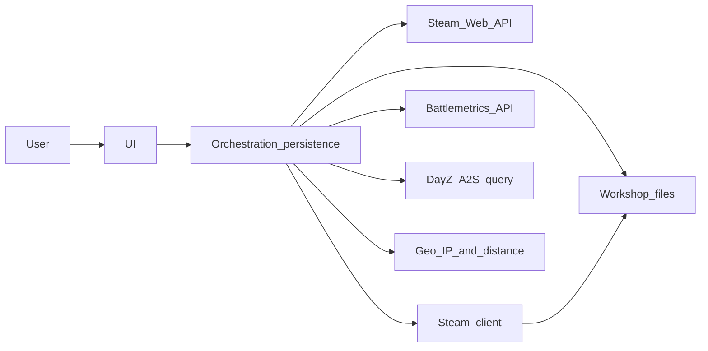

# Architecture and product: DayZ launcher for Linux

Reference document **independent of language and stack**. Describes domain, integrations, and observable capabilities of an application in this class, for reimplementation or requirements alignment.

## 1. Business objective

Provide a **graphical client** on **Linux** that allows:

- Discover and display **official and community/modded** DayZ servers.
- Show metadata in a table (name, population, queue, in-game time, distance, address, etc.).
- **Connect** to the game via **Steam** with coherent launch options (including stable / experimental branches).
- **Prepare mods** required by servers: manual or automatic installation from **Steam Workshop**, sync, and cleanup.
- Manage **saved servers** (favorites, up to **five** quick-favorite shortcuts) and **history** of recent connections.
- Support **LAN** servers with mods.

Product positioning aligns with easing DayZ-on-Linux limitations and centralizing orchestration in the client before starting the game.

## 2. Architectural principles

- **No dedicated aggregator backend** of the product itself: do not depend on an undocumented central server to list or enrich servers.
- **Direct connections** to **public, documented** services (Steam, Battlemetrics when the user opts in, A2S queries to servers) and, for geolocation, clear IP sources and licensed databases.
- **Operational longevity** by favoring official or widely used integrations over opaque dependencies.
- **Linux-first** (desktop and handheld-style Linux devices), not as a requirement for feature parity on other OSes.

### 2.1 Operating-system scope for this repository

The product vision targets **Linux**. **Windows** and **macOS** binaries may be producible with Wails (`wails build`, cross-compilation), but this project **does not** treat those targets as tested or supported: behavior, packaging, and QA are **Linux-first** unless explicitly documented otherwise elsewhere.

## 3. Logical component view

- **UI:** navigation, tables, filters, option dialogs.
- **Orchestration and persistence:** read/write configuration, server lists, history, process or query library invocation, and Steam launch construction.

## 4. External integrations

For each integration: **purpose**, **mandatory or not**, **conceptual I/O**, **risks and limits**.

### 4.1 Steam Web API — `IGameServersService/GetServerList/v1`

| Aspect | Description |
|--------|-------------|
| **Purpose** | Fetch large listings of servers **advertised on Steam** for the **DayZ** app (stable app id **221100**), with **filters** on the `filter` parameter in Valve’s documented format. Optionally, a **second** query for the **experimental** app (**1024020**) for full-ecosystem parity. |
| **Mandatory** | Yes, for the **Steam master-list** server browser. Without a valid key, that mode is unavailable (the client may still offer local lists, LAN, favorites). |
| **I/O** | **Input:** user API key, `appid`, `filter` string (map filters, empty, no players, etc.). **Output:** JSON array of servers; each item has fields used for name, `addr` (IP and query port), `gameport`, `map`, `gametype`, `players`, `max_players`, `ping`, etc. |
| **Risks** | Valve quotas and policies; empty responses or HTTP errors (e.g. 403) must be handled. A global **cooldown** (e.g. tens of seconds) after failure or empty list can reduce API hammering. Per-request row caps must respect documented limits (reference implementation may use a high ceiling in a single request). |

### 4.2 Steam client (`steam://`)

| Aspect | Description |
|--------|-------------|
| **Purpose** | Launch DayZ with parameters; open **Steam Workshop** pages (`CommunityFilePage`), community HTTP URLs, and subscription flows. |
| **Mandatory** | Yes, for **game connection** and Workshop mod management. |
| **I/O** | **Input:** `steam://` URIs and commands supported by the client. **Output:** game or Steam client process. |
| **Risks** | Differences between native and sandboxed installs (e.g. Flatpak): the client should allow **choosing** the command used to invoke Steam. |

### 4.3 Steam Workshop (local files)

| Aspect | Description |
|--------|-------------|
| **Purpose** | Store subscribed content under `steamapps/workshop/content/<appid>/`; each mod often has `meta.cpp` with **name** and **published id**. |
| **Mandatory** | Yes, for **automatic** mods or local listings. |
| **I/O** | **Input:** workshop IDs and Steam install directories. **Output:** per-ID folders; symlinks from the game folder to workshop folders with names derived from IDs or hashes. |
| **Risks** | Disk, permissions, and drift between Steam subscription and what the server requires. |

### 4.4 Steam Web API — published file metadata (optional)

| Aspect | Description |
|--------|-------------|
| **Purpose** | Endpoints such as **`ISteamRemoteStorage/GetPublishedFileDetails`** to validate published files (sizes, existence) when reconciling mod lists. |
| **Mandatory** | No; improves robustness for cleanup or remote comparison. |
| **I/O** | **Input:** list of `publishedfileid`. **Output:** per-file details. |
| **Risks** | Rate limits; requires a Steam key. |

### 4.5 Battlemetrics API

| Aspect | Description |
|--------|-------------|
| **Purpose** | (1) Resolve **Battlemetrics ID** → IP, **game port**, and **query port**. (2) In some cases, **fallback** when A2S rules/name query fails: search for a server matching query IP:port, when a token is configured. |
| **Mandatory** | **No.** Only needed for “connect / add by ID” and optional fallback. |
| **I/O** | **Input:** `Authorization: Bearer <token>`, filter parameters (game **dayz**, id whitelist, or search). **Output:** JSON including `ip`, `port`, `portQuery`. |
| **Risks** | Invalid key (HTTP 401); service availability; API terms of use. |

### 4.6 A2S (Source query) and DayZ extension

| Aspect | Description |
|--------|-------------|
| **Purpose** | **Live ping:** `A2S_INFO` for name, map, players, keywords, measured ping. **DayZ rules:** extension for **mod list** with **Workshop id** and **name** per mod. |
| **Mandatory** | Yes, for list quality (real ping, server detail, mods). |
| **I/O** | **Input:** IP and **query port**. **Output:** records normalizable to the same row model as the Steam list; logical modes equivalent to **info**, **mod ID list**, **names and IDs together**. |
| **Risks** | Firewall, timeout, misconfigured servers; some query modes may need **fallback** (e.g. via Battlemetrics). |

### 4.7 Geolocation and distance

| Aspect | Description |
|--------|-------------|
| **Purpose** | Estimate **distance in km** between the user and the server IP. |
| **Mandatory** | No; without location data, show **“Unknown”** or equivalent. |
| **I/O** | **Client public IP** (simple HTTP or DNS). **Client lat/lon** (public geo API, e.g. by IP). **Server lat/lon** from a **local** IP-range database (e.g. CSV derived from **DB-IP**, **CC BY 4.0** per project attribution). **Distance:** **haversine** or equivalent **shipped with the app** (no hard dependency on remote binary vendors). |
| **Risks** | Limited accuracy; VPNs; stale IP database. |

### 4.8 Auxiliary HTTP services

For connectivity or IP checks, public hostnames (e.g. IP echo) may be used. **DNS** documentation (OpenDNS) can replace missing system tools.

## 5. Conceptual “server” model (UI fields)

After **name sanitization** (control chars, invalid characters), a displayable row may include:

| Field | Typical source | Notes |
|-------|----------------|-------|
| Name | Steam or A2S | Short text for listing. |
| Map | `map` | Lowercased for filters. |
| Perspective | `gametype` keywords | **1PP** if `no3rd` exists, else **3PP**. |
| Provider | Keywords | **Official** vs unofficial (e.g. presence of `external`). |
| Modded | Keywords | **Yes** if `mod` appears in gametype. |
| In-game time | Regex on `gametype` | HH:MM when available; else “Unknown”. |
| Queue | `lqs` segment in `gametype` | Queue size when exposed. |
| Players / max | Numeric fields | Refreshable. |
| Address `IP:gameport` | From `addr` + `gameport` | Useful join identity. |
| Query port | Part of `addr` or dedicated field | Essential for A2S. |
| Ping | Steam list or A2S | High sentinel (e.g. 9999) when unknown; A2S refresh replaces. |
| Distance | Geo + haversine | “Unknown” if base or coordinates missing. |

**Refresh:** A2S can replace or complement Steam list fields, especially **ping** and near-real-time counts.

## 6. Product features

### 6.1 Steam master-list browser

- Fire **multiple** parallel calls with **distinct** filters (maps **Chernarus+**, **Sakhal**, **Namalsk**, **Enoch**, **empty** / **noplayers** variants, and combinations to cover the playable universe).
- **Merge** results and **parse** gametype defensively (malformed rows dropped per line).
- On global failure or unexpected empty response, apply **cooldown** before new API requests.

### 6.2 UI filters

**Checkboxes** that when **unchecked** **exclude** the indicated set:

| Filter | Intended behavior |
|--------|---------------------|
| 1PP / 3PP | Exclude servers in the opposite perspective. |
| Day / Night | In-game time ranges via regex (day vs night). |
| Empty / Full | Exclude zero players / full servers. |
| Low pop | Exclude servers above an occupancy threshold (e.g. percentage). |
| Non-ASCII | Exclude names with non-ASCII characters. |
| Duplicate | Keep first occurrence by name. |
| Official / Unoffic. | Exclude by provider label. |
| Modded | Exclude non-modded servers. |

If **mutually exclusive pairs** are both in “exclude” mode (e.g. 1PP and 3PP), the result may be an **empty list** (intentional to avoid incoherent state).

### 6.3 Map filter

- **“All maps”** entry plus **unique** values from the current list’s maps.
- Filter by **equality** to the normalized map name.

### 6.4 Keyword search

- **Substring** (case insensitive) on **server name**, **map name**, or **IP**.

### 6.5 Ping

- Explicit action to **refresh ping** for visible rows; may be limited to **once per filter context** to control load.
- Prefer **A2S** measurement when Steam list ping is sentinel.

### 6.6 Favorites and quick favorites

- Persistent list of full **favorites** (main table), keyed by **`IP:gameport:queryport`**.
- **Quick favorites:** up to **five** entries in their own list for launch shortcuts; a server may appear in **both** full favorites and quick favorites (removing from one does not remove from the other unless explicitly removed there).
- When the quick-favorite cap is reached, new additions on that path should be **rejected** with guidance to free a slot or use full favorites.
- **Battlemetrics:** only needed for numeric **ID** flows.

### 6.7 History

- Append **lines** to a store: each successful join appends a record **at the end**.
- If the same server key (**`IP:gameport:queryport`**) already exists, **replace** that entry with the latest snapshot (name, map, PP, provider, timestamp) instead of adding a duplicate.
- Keep a **maximum** number of recent entries (this codebase uses **10**: before append, drop oldest from the **front** when over cap — see `favhistory.AppendHistory` in Go).
- Explicit per-line removal.

### 6.8 Mods

- Show **server-side** mods (Workshop IDs and names when available).
- **Manual** mode: user manages subscriptions; **automatic** mode: client guides downloads and **syncs** folders and **links** into the game directory.
- Auxiliary ops: list installed mods, remove selected, detect **stale** or misaligned, force refresh.
- Open Workshop pages and Steam profile subscription list when relevant.

### 6.9 LAN

- Scan the local **subnet**: for each candidate, **ICMP** (when allowed) and **query** on the configured port to detect DayZ servers.

### 6.10 Connection and branches

- **Handshake** that builds **launch parameters** and delegates to Steam.
- Keep a clear split between **stable** and **experimental** apps (distinct AppIDs).

## 7. Configuration and persistence (conceptual)

Dimensions an equivalent client should persist (format free: file, local DB, etc.):

- **Identity:** in-game display name.
- **Keys:** Steam Web API (minimum length validation and test request); Battlemetrics (optional; HTTP validation).
- **Steam client:** preferred command (native vs sandboxed).
- **Paths:** Steam install, product branch (**stable** default for legacy configs).
- **Servers:** **favorites** list; **quick favorites** list (up to five entries); **history** of recent joins.
- **Caches:** local coordinates, API cooldown, cached lists for responsive UI.

This document **does not prescribe** file syntax or specific orchestration layers.

## 8. Extensibility and non-goals

- New data sources should be **documented** and **optional**, keeping the core on Steam + A2S.
- **Not** a goal to replicate all Steam client or Valve Windows launcher features.
- **Not** advisable to depend on unofficial aggregators without a clear contract.

## 9. Implementation in this repository

Concrete stack (Wails, Go, React, `internal/` and `frontend/`) and libraries are described in **[project-and-structure.md](./project-and-structure.md)**. Frontend visual guidelines are in **[design-system.md](./design-system.md)**.
