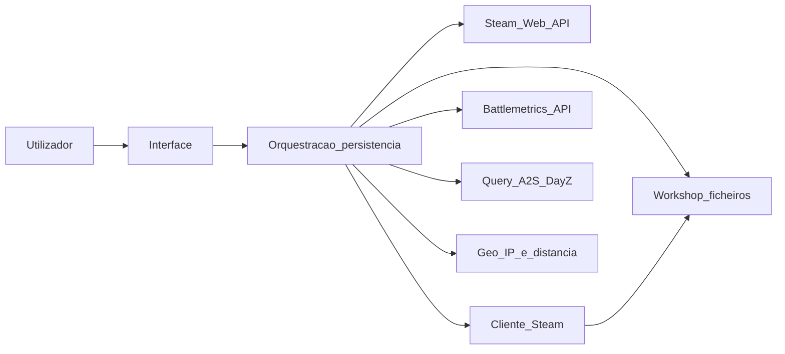

# Arquitetura e negócio: lançador DayZ para Linux

Documento de referência **independente de linguagem e de stack**. Descreve o domínio, integrações e capacidades observáveis de uma aplicação desta classe, para reimplementação ou alinhamento de requisitos.

## 1. Objetivo de negócio

Oferecer um **cliente gráfico** no **Linux** que permita:

- Procurar e apresentar servidores **oficiais e comunitários/modded** de DayZ.
- Exibir metadados em tabela (nome, população, fila, hora in-game, distância, endereço, etc.).
- **Ligar-se** ao jogo via **Steam** com opções de arranque coerentes (incl. branches stable / experimental).
- **Preparar mods** exigidos pelos servidores: instalação manual ou automática a partir do **Steam Workshop**, sincronização e limpeza.
- Gestionar **servidores guardados** (favoritos, etiqueta de “favorito” para ligação rápida) e **histórico** de ligações recentes.
- Suportar servidores **em LAN** com mods.

O posicionamento de produto alinha-se à ideia de contornar limitações do ecossistema DayZ no Linux e de concentrar no cliente a orquestração necessária antes de arrancar o jogo.

## 2. Princípios arquiteturais

- **Sem backend agregador dedicado** do próprio produto: não depender de um servidor central não documentado para listar ou enriquecer servidores.
- **Ligações diretas** a serviços **públicos e documentados** (Steam, Battlemetrics quando o utilizador opta, consulta A2S aos servidores) e, para geolocalização, a fontes de IP e bases de dados licenciadas de forma clara.
- **Longevidade operacional** priorizando integrações oficiais ou amplamente usadas, em vez de dependências opacas.
- **Foco em Linux** (ambiente de secretária e dispositivos tipo consola portátil com Linux), não como requisito de paridade com outros sistemas.

## 3. Visão lógica de componentes

- **Interface:** navegação, tabelas, filtros, diálogos de opções.
- **Orquestração e persistência:** leitura/escrita de configuração, listas de servidores, histórico, invocação de processos ou bibliotecas de query, e construção do arranque via Steam.

## 4. Integrações externas

Para cada integração: **finalidade**, **obrigatoriedade**, **entradas/saídas conceituais**, **riscos e limites**.

### 4.1 Steam Web API — `IGameServersService/GetServerList/v1`

| Aspeto | Descrição |
|--------|-----------|
| **Finalidade** | Obter listagens grandes de servidores **anunciados na Steam** para a app **DayZ** (identificador de aplicação estável **221100**), com **filtros** no parâmetro `filter` no formato documentado pela Valve. Incluir, se desejado paridade com o ecossistema completo, uma **segunda** consulta para a app **experimental** (**1024020**), com parâmetros adaptados. |
| **Obrigatório** | Sim, para o **browser de servidores** baseado na lista Steam. Sem chave válida, esse modo não está disponível (o cliente pode continuar a oferecer listas locais, LAN, favoritos). |
| **E/S** | **Entrada:** chave API do utilizador, `appid`, string `filter` (pode combinar restrições de mapa, vazios, sem jogadores, etc.). **Saída:** JSON com array de servidores; cada elemento contém campos usados para nome, `addr` (IP e porta de query), `gameport`, `map`, `gametype`, `players`, `max_players`, `ping`, etc. |
| **Riscos** | Quota e políticas da Valve; respostas vazias ou erros HTTP (ex.: 403) devem ser tratados. Pode impor-se **cooldown** global (ex.: dezenas de segundos) após falha ou lista vazia para evitar martelagem da API. Limite superior de linhas por pedido deve respeitar os limites documentados (na implementação de referência usa-se um teto alto num único pedido). |

### 4.2 Cliente Steam (`steam://`)

| Aspeto | Descrição |
|--------|-----------|
| **Finalidade** | Arrancar o DayZ com parâmetros; abrir páginas **Steam Workshop** (`CommunityFilePage`), URLs HTTP da comunidade, e fluxos de subscrição. |
| **Obrigatório** | Sim, para **ligação ao jogo** e gestão de mods via Workshop. |
| **E/S** | **Entrada:** URIs `steam://` e comandos suportados pelo cliente. **Saída:** processo do jogo ou do cliente Steam. |
| **Riscos** | Diferenças entre instalação nativa e empacotada (ex.: Flatpak): o cliente deve permitir **escolher** o comando usado para invocar o Steam. |

### 4.3 Steam Workshop (ficheiros locais)

| Aspeto | Descrição |
|--------|-----------|
| **Finalidade** | Armazenar conteúdos subscritos sob `steamapps/workshop/content/<appid>/`; cada mod costuma ter `meta.cpp` com **nome** e **published id**. |
| **Obrigatório** | Sim, para **mods** automáticos ou listagens locais. |
| **E/S** | **Entrada:** IDs de workshop e diretórios de instalação Steam. **Saída:** pastas por ID; ligações simbólicas da pasta do jogo para pastas de workshop com nomes derivados de IDs ou hashes. |
| **Riscos** | Disco, permissões, e drift entre subscrição Steam e o que o servidor exige. |

### 4.4 Steam Web API — metadados de ficheiros publicados (opcional)

| Aspeto | Descrição |
|--------|-----------|
| **Finalidade** | Endpoints como **`ISteamRemoteStorage/GetPublishedFileDetails`** para validar ficheiros publicados (tamanhos, existência) ao reconciliar listas de mods. |
| **Obrigatório** | Não; melhora robustez em cenários de limpeza ou comparação com o remoto. |
| **E/S** | **Entrada:** lista de `publishedfileid`. **Saída:** detalhes por ficheiro. |
| **Riscos** | Limites de taxa; necessidade de chave Steam. |

### 4.5 Battlemetrics API

| Aspeto | Descrição |
|--------|-----------|
| **Finalidade** | (1) Resolver **ID Battlemetrics** → endereço IP, **porta de jogo** e **porta de query**. (2) Em alguns cenários, **fallback** quando a query A2S a regras/nomes falha: pesquisa por servidor que corresponda ao par IP:porta de query, desde que exista chave configurada. |
| **Obrigatório** | **Não.** Só necessário para “ligar / adicionar por ID” e para fallback opcional. |
| **E/S** | **Entrada:** cabeçalho `Authorization: Bearer <token>`, parâmetros de filtro (jogo **dayz**, whitelist de ids, ou pesquisa). **Saída:** JSON com atributos incluindo `ip`, `port`, `portQuery`. |
| **Riscos** | Chave inválida (HTTP 401); dependência de disponibilidade do serviço; políticas de uso da API. |

### 4.6 Protocolo A2S (Source query) e extensão DayZ

| Aspeto | Descrição |
|--------|-----------|
| **Finalidade** | **Ping ao vivo:** `A2S_INFO` para nome, mapa, jogadores, keywords, ping medido. **Regras DayZ:** extensão para **lista de mods** com **identificador Workshop** e **nome** por mod. |
| **Obrigatório** | Sim, para qualidade da lista (ping real, detalhe do servidor, mods). |
| **E/S** | **Entrada:** IP e **porta de query**. **Saída:** registos normalizáveis para a mesma linha de dados que a lista Steam; modos lógicos equivalentes a **info**, **lista de IDs de mods**, **nomes e IDs em conjunto**. |
| **Riscos** | Firewall, timeout, servidores mal configurados; modos de query podem exigir **fallback** (ex.: via Battlemetrics). |

### 4.7 Geolocalização e distância

| Aspeto | Descrição |
|--------|-----------|
| **Finalidade** | Estimar **distância em km** entre o utilizador e o IP do servidor. |
| **Obrigatório** | Não; sem dados de localização, apresentar **“Unknown”** ou equivalente. |
| **E/S** | **Obter IP público** do cliente (serviço HTTP simples ou DNS). **Obter lat/lon** do cliente (API geo pública, ex.: por IP). **Resolver lat/lon do servidor** a partir de uma **base local** de intervalos IP (ex.: ficheiro CSV derivado de **DB-IP**, licença **CC BY 4.0** conforme atribuição do projeto). **Distância:** fórmula de **haversine** ou utilitário equivalente **empacotado com a aplicação** (sem acoplar a um fornecedor concreto de binários remotos). |
| **Riscos** | Precisão limitada; redes VPN; base IP desatualizada. |

### 4.8 Serviços HTTP auxiliares

Para verificação de conectividade ou IP, podem usar-se hostnames públicos (ex.: eco de IP). Documentação **DNS** (OpenDNS) pode substituir ferramentas ausentes no sistema.

## 5. Modelo conceitual de “servidor” (campos para UI)

Após **sanitização** do nome (controlos, caracteres inválidos), uma linha apresentável pode incluir:

| Campo | Origem típica | Notas |
|-------|----------------|-------|
| Nome | Steam ou A2S | Texto curto para listagem. |
| Mapa | `map` | Normalização para minúsculas para filtros. |
| Perspetiva | Keywords `gametype` | **1PP** se existir `no3rd`, senão **3PP**. |
| Fornecedor | Keywords | **Official** vs não oficial (ex.: presença de `external`). |
| Modded | Keywords | **Sim** se `mod` aparecer no gametype. |
| Hora in-game | Regex sobre `gametype` | Formato HH:MM quando disponível; senão “Unknown”. |
| Fila | Segmento `lqs` em `gametype` | Tamanho de fila quando o servidor o expõe. |
| Jogadores / máximo | Campos numéricos | Atualizáveis por refresh. |
| Endereço `IP:gameport` | Derivação de `addr` + `gameport` | Identidade útil para ligação. |
| Porta de query | Parte de `addr` ou campo dedicado | Essencial para A2S. |
| Ping | Lista Steam ou A2S | Valor sentinela alto (ex.: 9999) quando desconhecido; refresh por A2S substitui. |
| Distância | Geo + haversine | “Unknown” se faltar base ou coordenadas. |

**Refresh:** A2S pode substituir ou complementar campos obtidos pela lista Steam, especialmente **ping** e contagens em tempo quase real.

## 6. Recursos de produto

### 6.1 Browser baseado na lista Steam

- Disparar **várias** chamadas em paralelo com **filtros** distintos (mapas **Chernarus+**, **Sakhal**, **Namalsk**, **Enoch**, variantes **empty** / **noplayers**, e combinações usadas para cobrir o universo jogável).
- **Fundir** resultados e **parsear** gametype de forma defensiva (dados mal formados são descartados por linha).
- Em falha global ou resposta vazia inesperada, aplicar **cooldown** antes de novos pedidos à API.

### 6.2 Filtros da interface

Controlo por **caixas de seleção** que, quando **desmarcadas**, **excluem** o conjunto indicado:

| Filtro | Comportamento orientativo |
|--------|---------------------------|
| 1PP / 3PP | Excluir servidores na perspetiva oposta. |
| Day / Night | Intervalos de hora in-game por regex (dia vs noite). |
| Empty / Full | Excluir sem jogadores / cheios. |
| Low pop | Excluir servidores com ocupação acima de um limiar (ex.: percentagem). |
| Non-ASCII | Excluir nomes com caracteres não ASCII. |
| Duplicate | Manter primeira ocorrência por nome. |
| Official / Unoffic. | Excluir por etiqueta de fornecedor. |
| Modded | Excluir servidores não modded. |

Se **pares mutuamente exclusivos** estiverem ambos em modo “excluir” (ex.: 1PP e 3PP), o resultado pode ser **lista vazia** (comportamento intencional para evitar estados incoerentes).

### 6.3 Mapa

- Entrada **“All maps”** mais valores **únicos** extraídos dos mapas da lista atual.
- Filtro por **igualdade** ao nome do mapa já normalizado.

### 6.4 Pesquisa por palavra-chave

- **Substring** (case insensitive) no **nome do servidor**, **nome do mapa** ou **IP**.

### 6.5 Ping

- Ação explícita para **atualizar ping** das linhas visíveis; pode estar limitada a **uma vez por contexto** de filtros para controlar carga.
- Medição preferencial por **A2S** quando o ping da lista Steam for sentinela.

### 6.6 Favoritos e “servidor favorito”

- Lista persistente de registos **`IP:gameport:queryport`** (três componentes para endereço completo).
- Operações: adicionar, remover, alternar presença a partir da tabela.
- **Servidor favorito:** um registo destacado para **ligação rápida** com etiqueta legível.
- **Battlemetrics:** necessário apenas para fluxos **por ID** numérico.

### 6.7 Histórico

- Ficheiro ou store por **linhas**: cada ligação bem encaminhada acrescenta um registo **no fim**.
- **Não** acrescentar de novo um registo que **já exista** em qualquer linha do histórico.
- Manter um **número máximo** de entradas recentes (na ordem de **dez** linhas: antes de acrescentar, descartar linhas antigas por truncagem da cauda).
- Remoção explícita de entradas.

### 6.8 Mods

- Mostrar **mods do lado do servidor** (IDs Workshop e, se disponível, nomes).
- Modo **manual:** utilizador gere subscrições; modo **automático:** cliente guia downloads e **sincroniza** pastas e **ligações** ao diretório do jogo.
- Operações auxiliares: listar mods instalados, remover selecionados, detetar **obsoletos** ou desalinhados, forçar atualização.
- Abrir páginas Workshop e lista de subscrições do perfil Steam quando relevante.

### 6.9 LAN

- Varredura da **sub-rede** local: para cada candidato, **ICMP** (quando permitido) e **query** na porta configurável para detetar servidores DayZ.

### 6.10 Conexão e branches

- **Handshake** que monta **parâmetros de arranque** e delega ao Steam.
- Manter separação conceitual entre app **estável** e **experimental** (AppIDs distintos).

## 7. Configuração e persistência (conceitual)

Dimensões que um cliente equivalente deve guardar (formato livre: ficheiro, base local, etc.):

- **Identidade:** nome de jogador apresentado no jogo.
- **Chaves:** Steam Web API (validação com comprimento mínimo e pedido de teste); Battlemetrics (opcional; validação por HTTP).
- **Cliente Steam:** comando preferido (nativo vs ambiente empacotado).
- **Janela:** fullscreen vs último tamanho.
- **Caminhos:** instalação Steam, ramo do produto (**stable** por omissão em configurações antigas).
- **Comportamento:** modo debug; **instalação automática de mods** vs manual.
- **Servidores:** lista `ip_list`; **favorito** `fav_server` e etiqueta `fav_label`.
- **Caches:** coordenadas locais, cooldown de API, cópias de listas para UI rápida.

O documento **não prescreve** sintaxe de ficheiro nem uso de camadas específicas de orquestração.

## 8. Extensibilidade e não objetivos

- Novas fontes de dados devem ser **documentadas** e **opcionais**, mantendo o núcleo funcional com Steam + A2S.
- **Não** é objetivo replicar todas as funções do cliente Steam ou do launcher Windows da Valve.
- **Não** é recomendável depender de serviços agregadores não oficiais sem contrato claro.

